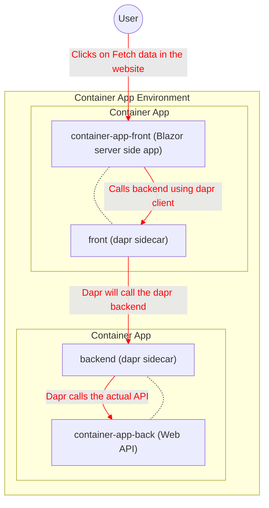

# ContainerAppExperiment
The purpose of this repository is to be able to deploy Azure Container App with Dapr using .NET 6 C# code.

It is using the Blazor Server default code with the modification of the backend calling the backend service using dapr. Currently the Fetch data Weather forecast is the one being replaced to use Dapr calls. 

> More documentation to come

## Deploying to Azure
Deploying the docker images of this repository in the Azure Container Apps with Dapr:
- [container-app-back](https://hub.docker.com/r/uyandrew/container-app-back)
- [container-app-front](https://hub.docker.com/r/uyandrew/container-app-front)

**Pre-requisite**
- Azure account
- Powershell
- [Azure CLI](https://docs.microsoft.com/en-us/cli/azure/install-azure-cli)
- Azure Container Apps Extension to CLI
```
az extension add `
  --source https://workerappscliextension.blob.core.windows.net/azure-cli-extension/containerapp-0.2.4-py2.py3-none-any.whl
```

**Steps**

Please run the scripts in blocks as shown in here:
```
az login
```

```
$RESOURCE_GROUP="container-apps-experiment"
$LOCATION="eastus"
$LOG_ANALYTICS_WORKSPACE="container-apps-logs"
$CONTAINERAPPS_ENVIRONMENT="experiment"
```

```
az group create `
  --name $RESOURCE_GROUP `
  --location $LOCATION
```

```
az monitor log-analytics workspace create `
  --resource-group $RESOURCE_GROUP `
  --workspace-name $LOG_ANALYTICS_WORKSPACE
```

```
$LOG_ANALYTICS_WORKSPACE_CLIENT_ID=(az monitor log-analytics workspace show --query customerId -g $RESOURCE_GROUP -n $LOG_ANALYTICS_WORKSPACE --out tsv)
```

```
$LOG_ANALYTICS_WORKSPACE_CLIENT_SECRET=(az monitor log-analytics workspace get-shared-keys --query primarySharedKey -g $RESOURCE_GROUP -n $LOG_ANALYTICS_WORKSPACE --out tsv)
```

```
az containerapp env create `
  --name $CONTAINERAPPS_ENVIRONMENT `
  --resource-group $RESOURCE_GROUP `
  --logs-workspace-id $LOG_ANALYTICS_WORKSPACE_CLIENT_ID `
  --logs-workspace-key $LOG_ANALYTICS_WORKSPACE_CLIENT_SECRET `
  --location "$LOCATION"
```

```
az containerapp create `
  --name back `
  --resource-group $RESOURCE_GROUP `
  --environment $CONTAINERAPPS_ENVIRONMENT `
  --image docker.io/uyandrew/container-app-back:latest `
  --target-port 80 `
  --ingress 'internal' `
  --min-replicas 1 `
  --max-replicas 1 `
  --enable-dapr `
  --dapr-app-port 80 `
  --dapr-app-id backend
```

```
az containerapp create `
  --name front `
  --resource-group $RESOURCE_GROUP `
  --environment $CONTAINERAPPS_ENVIRONMENT `
  --image docker.io/uyandrew/container-app-front:latest `
  --target-port 80 `
  --ingress 'external' `
  --min-replicas 1 `
  --max-replicas 1 `
  --environment-variables DaprBackend=backend `
  --enable-dapr `
  --dapr-app-id front
```

The application is in the Container App called `front`. Click on the Application Url to play around with the application.

**Deleting the Resource Group**

When you are done checking out the created Azure resources and playing with the application, you can simply delete all of it to prevent from unnecessary charges in your account.
```
az group delete `
    --resource-group $RESOURCE_GROUP
```

## Workflow Diagram


